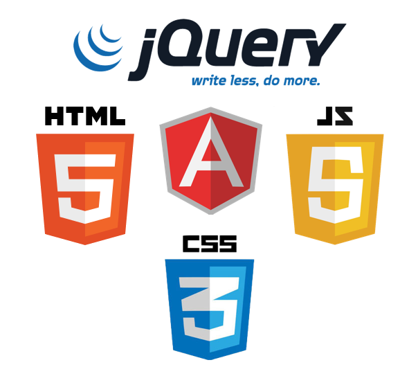

# Description

This front-end web app was designed to help organize competitive ping pong players at a local level. Players create user profiles that will keep track of their game history, schedule, individual player statistics, and rankings (using a real elo formula).
 

## Technologies

|   Technology |   Deployment |       
|  ----------- | ------------|
|   Angular JS | heroku |
|   jQuery     ||
|   HTML       ||
|   CSS        ||
 
 

##  User Model

| Parameters  | Value   	| Description | Example |
| ----------- | ----------	| ------------ | ------- |
| First Name    	| String 		| First Name of User | "Roger" |
| Last Name | String | Last Name of User | "Chavez"
| Email 		| String  	| Email of User  | "roger.chavez@gmail.com" |
| D.O.B. 	| Date   	| Date of Birth of User 	   	 | "08/08/1988" |
| Gender 		| String     	| Male or Female   	   	 | "Male" |
| Age	| Number    	| Age of User| 28|
| wins 	| Number     	| Automatically set to 0 when starting a new account | 0 |
| losses 	| Number     	| Automatically set to 0 when starting a new account | 0 |
| Elo Rank	| Number     	| Automatically set to 2000 when starting a new account | 2000 |
| Img 	| Link     	| A default Img is provided when starting a new account |  |
 

## Planning and Approach
For our first front end development project, tasks were delegated and roles were identified as a mutual team decision. The plan consisted of getting the core framwork and fuctions working through angular and then constructing a UX minded Font End. 

## Team Roles
- Ranking page layout and interactivity - Shawn Pridmore
- Header, Footer, and schedule layout and interactivity -  Issac Escobar
- Create new Users and profile page layout, interactivity, and elo ranking - Roger Chavez

## Challenges
- First time using Github. We were extra careful doing pull/push requests throughout the project. 
- Figuring out how to properly route my pages.
- Properly making my pages reactive and accessing my players data and being able to update it. 

